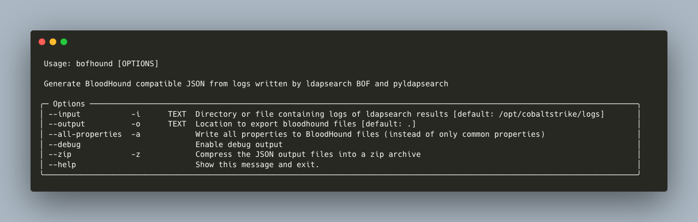

# THIS REPO IS NO LONGER ACTIVE
⛔🚧 This repo is no longer maintained. To submit an issue, pull request, or obtain the lastest version, reference [https://github.com/coffeegist/bofhound](https://github.com/coffeegist/bofhound) 🚧⛔
```
 _____________________________ __    __    ______    __    __   __   __   _______
|   _   /  /  __   / |   ____/|  |  |  |  /  __  \  |  |  |  | |  \ |  | |       \
|  |_)  | |  |  |  | |  |__   |  |__|  | |  |  |  | |  |  |  | |   \|  | |  .--.  |
|   _  <  |  |  |  | |   __|  |   __   | |  |  |  | |  |  |  | |  . `  | |  |  |  |
|  |_)  | |  `--'  | |  |     |  |  |  | |  `--'  | |  `--'  | |  |\   | |  '--'  |
|______/   \______/  |__|     |__|  |___\_\________\_\________\|__| \___\|_________\

                              by Fortalice ✪
```

# BOFHound

BOFHound is an offline BloodHound ingestor and LDAP result parser compatible with TrustedSec's [ldapsearch BOF](https://github.com/trustedsec/CS-Situational-Awareness-BOF), the Python adaptation, [pyldapsearch](https://github.com/fortalice/pyldapsearch) and Brute Ratel's [LDAP Sentinel](https://bruteratel.com/tabs/commander/badgers/#ldapsentinel).

By parsing log files generated by the aforementioned tools, BOFHound allows operators to utilize BloodHound's beloved interface while maintaining full control over the LDAP queries being run and the spped at which they are executed. This leaves room for operator discretion to account for potential honeypot accounts, expensive LDAP query thresholds and other detection mechanisms designed with the traditional, automated BloodHound collectors in mind.

[Blog - Granularize Your AD Recon Game](https://www.fortalicesolutions.com/posts/bofhound-granularize-your-active-directory-reconnaissance-game)

[Blog - Granularize Your AD Recon Game Part 2](https://www.fortalicesolutions.com/posts/granularize-your-active-directory-reconnaissance-game-part-2)

# Installation
BOFHound can be installed with `pip3 install bofhound` or by cloning this repository and running `pip3 install .`

# Usage



## Example Usage
Parse ldapseach BOF results from Cobalt Strike logs (`/opt/cobaltstrike/logs` by default) to /data/
```
bofhound -o /data/
```

Parse pyldapsearch logs and only include all properties (vs only common properties)
```
bofhound -i ~/.pyldapsearch/logs/ --all-properties
```

Parse LDAP Sentinel data from BRc4 logs (will change default input path to `/opt/bruteratel/logs`)
```
bofhound --brute-ratel
```

# ldapsearch

## Required Data
The following attributes are required for proper functionality:

```
samaccounttype
dn
objectsid
```

## Example ldapsearch Queries
Get All the Data (Maybe Run BloodHound Instead?)
```
ldapsearch (objectclass=*) *,ntsecuritydescriptor
```

Retrieve All Schema Info
```
ldapsearch (schemaIDGUID=*) name,schemaidguid -1 "" CN=Schema,CN=Configuration,DC=windomain,DC=local
```

Retrieve Only the ms-Mcs-AdmPwd schemaIDGUID
```
ldapsearch (name=ms-mcs-admpwd) name,schemaidguid 1 "" CN=Schema,CN=Configuration,DC=windomain,DC=local
```

# Development
bofhound uses Poetry to manage dependencies. Install from source and setup for development with:

```shell
git clone https://github.com/fortalice/bofhound
cd bofhound
poetry install
poetry run bofhound --help
```

# References and Credits
- [@_dirkjan](https://twitter.com/_dirkjan) (and other contributors) for [BloodHound.py](https://github.com/fox-it/BloodHound.py)
- TrustedSec for [CS-Situational-Awareness-BOF](https://github.com/trustedsec/CS-Situational-Awareness-BOF)
